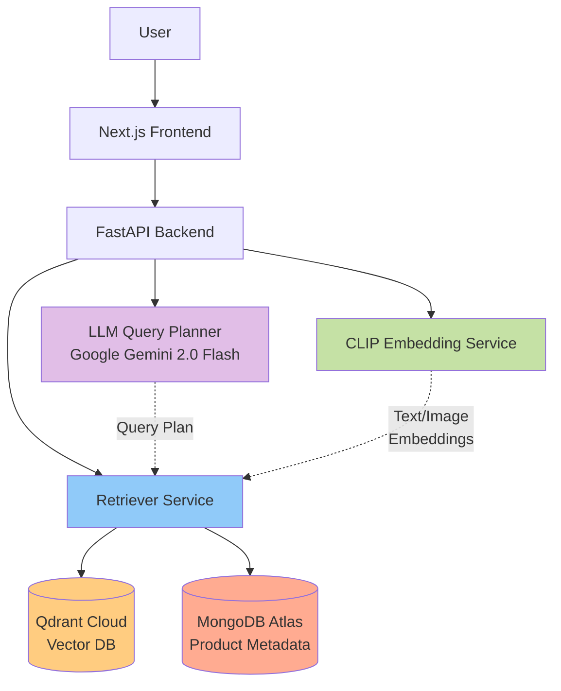

# Perplexity for Fashion: Agentic Multimodal Search System

An AI-powered fashion search system with multimodal capabilities (text, image, and combined queries), featuring LLM-based query planning and a Perplexity-style chat interface.


## 🌟 Features

- **Multimodal Search**: Search using text, images, or both combined
- **Agentic Query Planning**: Google Gemini-powered query decomposition and optimization
- **Perplexity-Style UI**: Clean, modern chat interface with product results
- **CLIP Embeddings**: State-of-the-art multimodal embeddings (`openai/clip-vit-base-patch32`)
- **Vector Search**: Fast similarity search using Qdrant Cloud
- **Cloud Native**: Uses MongoDB Atlas and Qdrant Cloud (No local Docker required)
- **Automatic Evaluation**: Built-in benchmark and regression testing

## 🏗️ Architecture



## 📋 Prerequisites

- **Python 3.10+**
- **Node.js 18+** with npm
- **Google API Key** (for Gemini LLM)
- **MongoDB Atlas** Account & Cluster
- **Qdrant Cloud** Account & Cluster

## 🚀 Quick Start

### 1. Backend Setup

```bash
cd backend

# Install dependencies
pip install -r requirements.txt

# Configure environment
# Ensure your .env file has GOOGLE_API_KEY, MONGODB_URI, QDRANT_URL/KEY

# Download and ingest data (~10-15 minutes)
# This downloads the Fashion200k subset and populates your cloud databases
python3 -m ingestion.download_dataset    
python3 -m ingestion.ingest_to_mongo     
python3 -m ingestion.generate_embeddings 

# Start backend server
python3 -m uvicorn app.main:app --reload
```

Backend will be available at `http://localhost:8000`

### 2. Frontend Setup

Open a new terminal:

```bash
cd frontend

# Install dependencies
npm install

# Start development server
npm run dev
```

Frontend will be available at `http://localhost:3000`

### 3. Try It Out!

1. Open http://localhost:3000
2. Try these example queries:
   - 💬 **Text**: "black midi dress for a summer wedding"
   - 🖼️ **Image**: Upload a clothing photo
   - ✨ **Combined**: Upload image + "same style but in red"

## 📊 Evaluation & Testing

### Create Benchmark Dataset

```bash
cd backend
python3 -m evaluation.create_benchmark
```

### Run Evaluation

```bash
python3 -m evaluation.evaluate
```

Metrics reported:
- **Recall@K**: % of queries where expected product appears in top-K
- **MRR**: Mean reciprocal rank of first correct result
- **Success Rate**: Overall query success percentage

## 🛠️ Technology Stack

### Backend
- **FastAPI**: Modern async Python web framework
- **Google Gemini 2.0 Flash**: Agentic query planning and response generation (Replaced GPT-4o)
- **OpenAI CLIP**: `openai/clip-vit-base-patch32` for robust multimodal embeddings
- **Qdrant Cloud**: Managed vector database for similarity search
- **MongoDB Atlas**: Managed NoSQL database for product metadata
- **Motor**: Async MongoDB driver

### Frontend
- **Next.js 14**: React framework with App Router
- **TypeScript**: Type-safe development
- **TailwindCSS**: Utility-first styling
- **Lucide React**: Modern icon library

## 📁 Project Structure

```
kloth.me/
├── backend/
│   ├── app/
│   │   ├── main.py              # FastAPI app
│   │   ├── config.py            # Configuration
│   │   ├── models.py            # Pydantic models
│   │   └── services/
│   │       ├── embedding_service.py   # CLIP embeddings
│   │       ├── llm_planner.py        # Gemini Query planning
│   │       ├── retriever.py          # Vector search
│   │       └── database.py           # MongoDB service
│   ├── ingestion/
│   │   ├── download_dataset.py       # Dataset downloader
│   │   ├── ingest_to_mongo.py        # MongoDB ingestion
│   │   └── generate_embeddings.py    # Embedding generation
│   ├── evaluation/
│   │   ├── create_benchmark.py       # Benchmark creation
│   │   └── evaluate.py               # Evaluation script
│   └── requirements.txt
├── frontend/
│   ├── app/
│   ├── components/
│   ├── lib/
│   └── package.json
└── README.md
```

## 🔌 API Reference

### `POST /api/chat`

Main chat endpoint for multimodal search.

**Request** (multipart/form-data):
```typescript
{
  message: string;           // Required: User's text query
  image?: File;              // Optional: Image file upload
  chat_history?: string;     // Optional: JSON string of chat history
}
```

**Response**:
```typescript
{
  assistant_message: string;     // Natural language summary
  results: ProductResult[];      // Ranked product results
  debug?: {                      // Optional debug info
    query_plan: {
      refined_queries: string[];
      use_image: boolean;
      text_weight: number;
      top_k: number;
      reasoning: string;
    };
    // ... metrics
  };
}
```

## 🐛 Troubleshooting

### "Connection refused" / Database Errors
- Ensure you have valid **MongoDB Atlas** and **Qdrant Cloud** credentials in your `.env`.
- This project runs purely on cloud services; local Docker instances are not required.

### "NaN detected" / Search returns no results
- Ensure you are using the `openai/clip-vit-base-patch32` model in `config.py`. 
- Re-run `ingestion.generate_embeddings` to refresh your vector store if you changed models.

### Gemini API 404
- Verify your `GOOGLE_API_KEY` is active.
- Ensure `GEMINI_MODEL` in `.env` corresponds to a model your key has access to (e.g., `gemini-2.0-flash` or `gemini-1.5-flash`).

## 📝 License

MIT License - see LICENSE file for details

## 💡 Acknowledgments

- Fashion200k dataset
- CLIP model by OpenAI
- Perplexity.ai for UI inspiration

---

**Built with ❤️ for the multimodal AI search challenge**
